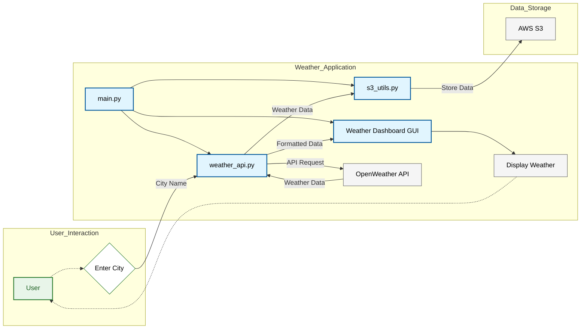

As part of the **30 Days DevOps Challenge** from **Cozy Cloud Crew**, I started on a journey to refine my cloud (specially AWS) and DevOps skills. For Day 1, the challenge was to build a Python-based **Weather Dashboard** that fetches real-time weather data and securely stores it in an AWS S3 bucket. This blog will take you through my project, challenges, and learnings from Day 1.

---

## **Project Overview**

The **Weather Dashboard** app retrieves real-time weather data for any city using the **OpenWeatherMap API**. It displays the weather data in a clean GUI built with **Tkinter** and saves the raw data in JSON format to an AWS S3 bucket for long-term storage or analysis.

### **Core Features**

* **Data Fetching:** Retrieves current weather details using OpenWeatherMap API.
    
* **User-Friendly Interface:** A graphical interface for input and display.
    
* **Cloud Integration:** Stores fetched weather data in an AWS S3 bucket via the **Boto3** SDK.
    

---

## **Tech Stack**

* **Python**: Core programming language.
    
* **Tkinter**: For creating the GUI.
    
* **Boto3**: AWS SDK for Python to interact with S3.
    
* **dotenv**: To manage sensitive credentials.
    
* **OpenWeatherMap API**: For real-time weather data.
    

---

## **Project Structure**

The project was modular, organized as follows:

```bash
weather-dashboard/
├── src/                 # Source code for the application
│   ├── __init__.py      # Makes src a package (can be empty)
│   ├── gui.py           # Tkinter GUI code
│   ├── weather_api.py   # Weather API interaction logic
│   └── s3_utils.py      # S3 bucket interaction logic
├── tests/               # Unit tests for the application
│   ├── __init__.py     
│   ├── test_gui.py
│   ├── test_weather_api.py
│   └── test_s3_utils.py
├── .gitignore           # Files/folders to exclude from Git
├── requirements.txt     # Project dependencies
├── README.md            # Project description and instructions
└── main.py              # Entry point of the application
```

#### Checkout the Github Repo:

%[https://github.com/ChetanThapliyal/30-days-devops-challenge-AWS-NBA/tree/main] 

Check out the Day 1 code here : [Day 1 - Weather Dashboard](https://github.com/ChetanThapliyal/30-days-devops-challenge-AWS-NBA/tree/main/day1-weather-dashboard)

## Architecture

> Fun fact: I had bit of time so I also learned to create Mermaid diagrams, it was a fun activity. Below is the outcome of my learning.



## **Learnings and Reflections**

This project gave me hands-on experience with cloud and DevOps principles. Here are my key takeaways:

1. **Managing Secrets Securely:**  
    Storing API keys and AWS credentials in a `.env` file ensured sensitive information wasn’t exposed in the codebase. Using `dotenv`, I dynamically loaded these variables at runtime.
    
2. **Cloud Storage Basics:**  
    While I had prior experience with AWS, integrating an application to dynamically interact with S3 gave me insights into API-first design.
    
3. **GUI Development with Tkinter in Python:**  
    Building a graphical interface taught me how to enhance usability while adhering to project requirements.
    
4. **Writing Unit Tests:**  
    Testing each module independently was a valuable learning experience. It reinforced the importance of modular design and highlighted how unit tests ensure reliability. For example, I tested API responses with mock data and verified S3 interactions using a test bucket.
    

---

## **Challenges and Troubleshooting**

The issues and errors I faced and troubleshooted:

### **1\. IllegalLocationConstraintException**

* **Problem:** When creating an S3 bucket, I encountered this error due to an unspecified or mismatched region.
    
* **Solution:** Updated `boto3.client()` to include the appropriate region:
    
    ```python
    self.s3 = boto3.client('s3', region_name='ap-south-1')
    ```
    

### **2\. NoSuchBucket Error**

* **Problem:** This error occurred when trying to save data to a non-existent S3 bucket.
    
* **Solution:** I added a function to verify bucket existence and ensure creation:
    
    ```python
    def create_bucket_if_not_exists(bucket_name):
        if bucket_name not in existing_buckets:
            s3.create_bucket(Bucket=bucket_name, CreateBucketConfiguration={'LocationConstraint': 'ap-south-1'})
    ```
    

---

## **Outcome**

The final app successfully fetched weather data, displayed it on the GUI, and saved it to S3. Here’s a snapshot of the GUI:


---

## **Final Thoughts**

This project laid a strong foundation for integrating Python apps with cloud services. It gave me a glimpse into **real-world challenges**, from handling API responses to troubleshooting AWS configuration issues. Most importantly, it solidified my belief that hands-on projects are the best way to learn DevOps.

---

## 🚀 **What's Next?**

Next up, I’ll be working on a **Game Day Notification System**. Stay tuned as I continue this challenge, building new projects and documenting my journey.

If you’re curious, feel free to check out the project repository: [Weather Dashboard Repo](https://github.com/ChetanThapliyal/30-days-devops-challenge-AWS-NBA/tree/main/day1-weather-dashboard)